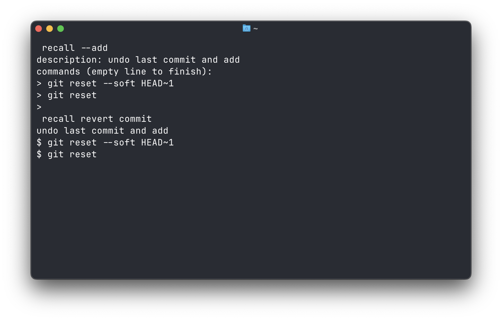
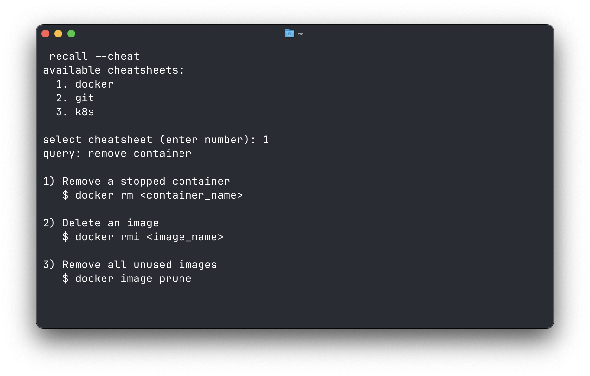

# recall




[](https://github.com/spider-hand/recall/actions/workflows/ci.yml) [](https://opensource.org/licenses/MIT) [](https://pkg.go.dev/github.com/spider-hand/recall) [](https://goreportcard.com/report/github.com/spider-hand/recall)

A CLI tool to find commands by describing what you want to do when you forget them

## Features
- Search commands by describing what you want to do, similar to asking ChatGPT
- Build your own command memo with custom descriptions and commands
- Quickly look up commands from official cheatsheets

## Motivation

Even after years of working as a software engineer, I still find myself forgetting commands and searching for them again and again.

You could search your shell history, keep notes, or ask ChatGPT, but sometimes that might feel like overkill.

I built this since I thought it would be helpful to have something that provides a similar UX to asking ChatGPT, but directly in the terminal.

## Installation

### Github Release

Download the latest binary from [releases](https://github.com/spider-hand/recall/releases).

### Homebrew

```sh
brew tap spider-hand/tap
brew install recall
```

### Go

```sh
go install github.com/spider-hand/recall@latest
```

## Usage

### Search

Search commands by describing what you want to do:

```sh
recall <query>
```

Example:

```sh
recall delete branch
```

Output example:

```sh
delete local branch
$ git branch -d <branch>
```

If multiple results are found, they are listed:

```sh
1) delete local branch
   $ git branch -d <branch>

2) delete remote branch
   git push origin --delete <branch>
   $ git fetch -p
```

### Add

```sh
recall --add
```

Example:

```sh
description: delete local branch

> git branch -d <branch>
```

You can enter multiple commands. Press Enter on an empty line to finish.

Example:

```sh
description: undo last commit

> git reset --soft HEAD~1
> git reset
```

### Import & Cheat
You can import pre-defined command cheatsheets created based on the official docs by using `--import`. If you want to search a command in a cheatsheet, use `--cheat`.


Here are the available cheatsheets:
- [Git](https://git-scm.com/cheat-sheet)
- [Docker](https://www.docker.com/resources/cli-cheat-sheet/)
- [Kubernetes](https://kubernetes.io/docs/reference/kubectl/quick-reference/)

### Other Actions

```
-a, --add               Add a new entry
-e, --edit <query>      Edit an entry
-d, --delete <query>    Delete an entry
-l, --list              List all entries
-i, --import            Import from cheatsheet
-c, --cheat             Search in cheatsheet
-v, --version           Show version
-h, --help              Show help message
```

## License

[MIT](./LICENSE)
